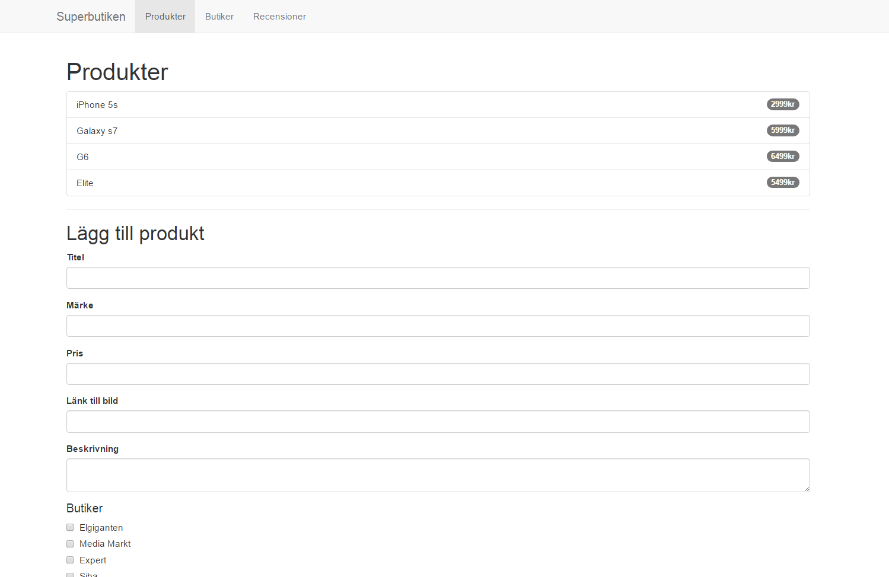
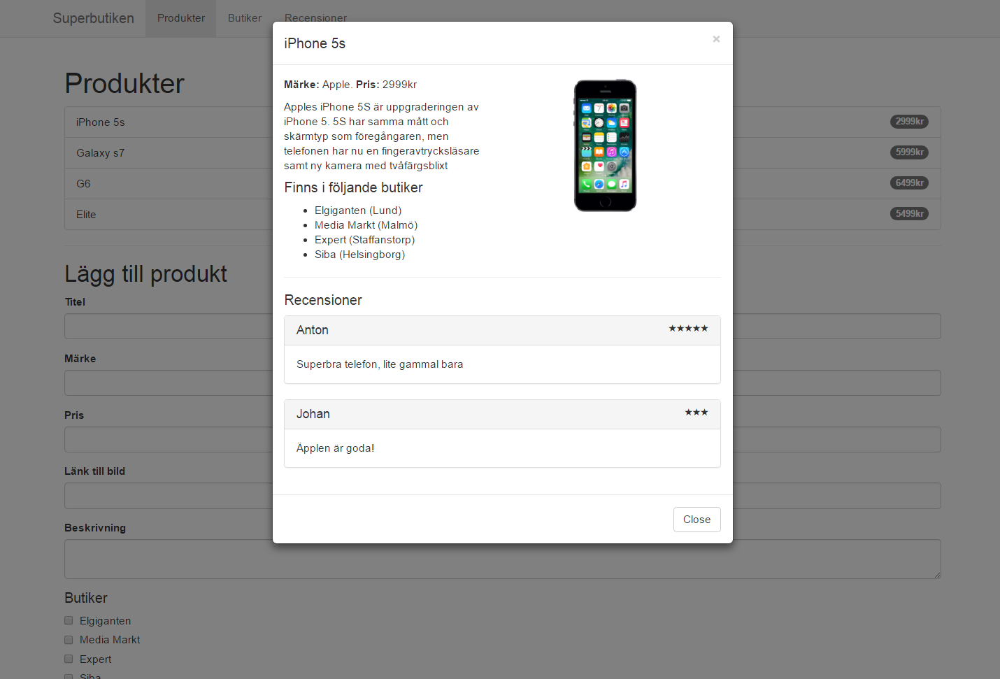
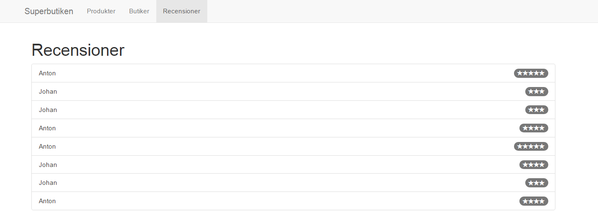

# Inlämningsuppgift 2 - API med Lumen

I denna inlämningsuppgift ska vi bygga ett enklare API med ramverket [Lumen](https://lumen.laravel.com). Sist i inlämningsuppgiften finns bilder & video på exempellösning.

## 1. Story

Ni har blivit kontaktade av företaget _Superbutiken_ som utvecklar en webbsida lista upp tekniska produkter, var dessa produkter kan inhandlas, samt recensioner kring dessa produkter. _Superbutikens_ största problem är att kan ingenting om datalagring och serverprogrammering - men är å andra sidan ganska bra på att bygga användargränssnitt genom HTML/CSS/JS.

De vill nu ha hjälp med att bygga ett API där information om _produkter_, _butiker_ och _recensioner_ lagras. De vill även att man i efterhand kan lägga till nya produkter och knyta dessa till olika butiker. Självklart finns det stora planer på vidareutveckling - men än så länge så nöjer de sig med detta.

## 2. Specifikation av API:t

_Superbutiken_ har tagit fram en kravspecifikation gällande hur API:t ska utformas, enligt följande:

### Routes

- GET `/products` ([exempelsvar](json_products.json))
    - Listar alla produkter
- GET `/products/{id}` ([exempelsvar](json_product.json))
    - Visar detaljerad information om en produkt
        - Inklusive produktens recensioner
        - Inklusive vilka butiker produkten finns i
- POST `/products` ([exempelsvar](json_new_product.json))
    - Skapar en ny produkt genom att skicka följande variabler i `POST`-anropet
        - `title`
        - `brand`
        - `price`
        - `image`
        - `description`
        - `stores` (Skickas som en array)*
- GET `/stores` ([exempelsvar](json_stores.json))
    - Listar alla butiker
- GET `/reviews` ([exempelsvar](json_reviews.json))
    - Lista alla recensioner

* När man tar emot en array av data i ett anrop så kan man enkelt iterara över denna genom en `foreach`-loop, likt detta:
```php
foreach ($request->get("stores") as $store) {
    // Do something fun!
}
```

### 2.1. Resurser

Följande resurser, med databasegenskaper nedan, ska finnas (*notera att dessa sklijer sig något från labben*):

- product
    - id (auto_increment, primary key)
    - title (text)
    - brand (text)
    - image (text)
    - description (text)
    - price (integer)
    - created_at (timestamp)
    - updated_at (timestamp)
- store
    - id (auto_increment, primary key)
    - name (text)
    - city (text)
    - created_at (timestamp)
    - updated_at (timestamp)
- review
    - id (auto_increment, primary key)
    - name (text)
    - comment (text)
    - grade (integer)
    - product_id (integer)
    - created_at (timestamp)
    - updated_at (timestamp)
- product_store
    - id (auto_increment, primary key)
    - store_id (integer)
    - product_id (integer)
    - created_at (timestamp)
    - updated_at (timestamp)

### 2.2. Data till databasen

Eftersom _Superbutiken_ redan har några produkter, butiker & recensioner så delar de gärna med sig av sina underlag för s.k. `seeds` för att fylla upp databasen.
- [Seeds för products](seed_products.php)
- [Seeds för stores](seed_stores.php)
- [Seeds för reviews](seed_reviews.php)
- [Seeds för product_store](seed_product_store.php)

### 2.3. Routes, models & controllers

Definiera de routes som behövs i `rountes/web.php`, skapa de modeller som behövs i `app/` och gör de controllers som krävs för ett uppfyller kraven ovan i `app/http/controllers/`

*Dubbelkolla sedan att ert API motsvarar de exempelsvar som finns under rubriken "Rountes" ovan*

## 3. Bygg ihop ert API med _Superbutikens_ GUI

Ni hittar _Superbutikens_ GUI [här på GitHub](https://github.com/Tibbelit/da287a-vt-assignment2-client). Instruktioner för hur ni kommer igång med GUI:t finns i projekts `README.md`-fil. Ladda ner detta och testa så att det fungerar som förväntat.

### 3.1. CORS - Måste fixas!
Normalt sett så vill man inte att det genom JavaScript ska kunna skickas ajax-anrop till tjänster som denna - om anropen kommer från en annan domän än vår egen. För den intresserade kan man [läsa mer om detta här](https://developer.mozilla.org/en-US/docs/Web/HTTP/Access_control_CORS). Vi vill i alla fall göra så att _vem som helst_ i detta fall får lov att använda vårt API genom ajax-anrop - eftersom _Superbutiken_ vill kunna dela sig av sin data till alla!

Detta kan ibland vara lite knepigt, men som tur är finns det paket för detta! Ett exempel på ett sådant paket är [Lumen-CORS](https://github.com/palanik/lumen-cors).
1. Installera detta paketet genom `composer require "palanik/lumen-cors:dev-master"`
2. På rad (cirka 62-64) i filen `bootstrap/app.php` avkommentera och skriv följande:
```php
$app->middleware([
    palanik\lumen\Middleware\LumenCors::class
]);
```
(Denna information finns även i utförliggare form på GitHub: [Lumen-CORS](https://github.com/palanik/lumen-cors))

### 3.2. Att testa GUI:t (och hitta ev. fel)
När ni byggt ert API så att det motsvarar de krav beskrivit ovan - så kommer det GUI som ni precis laddat ner att fungera fint! Skulle något inte fungera så kan ni alltid se vad som blir fel genom loggarna i Lumen som ni hittar i `storage/logs/lumen.log`.

*OBS.* Er webbserver för API:t _måste_ köras på följande adress för att det ska fungera `http://localhost:8000/`.

## 4. Krav

Följande krav finns på uppgiften:

- Uppgiften ska följa uppgiftsbeskrivningen ovan
- Ni ska använda er av `migrations` för att skapa era tabeller
- Ni ska använda er utav `seeds` för att populera era tabeller
- Ni ska använda er utav `controllers` för att hantera logiken för er applikation
- Ni ska använda er utav `models` för att mappar era resurser mot databaser (ORM)
- Ni ska följa PSR-1 & PSR-2 när det gällen hur ni skriver er kod

## 5. Inlämning & deadline
Inlämningen sker genom att ni publicerar er lösning på Github och skickar in adressen till er lösning på Its learning. Glöm inte att uppgiften ska utföras och redovisas enskilt.

Uppgiften ska vara inlämnad senaste söndagen den *30:e april*, 23.59. Uppgifter som lämnas in efter deadline kommer att rättas i samband med nästa inlämningsuppgift.

## 6. Exempellösningar

### 6.1. Video

[](https://youtu.be/Xh0xWvBPHuM)

### 6.2. Bild - Start



### 6.3. Bild - Detaljer om en product



### 6.4. Bild - Butiker


### 6.5. Bild - Recensioner


