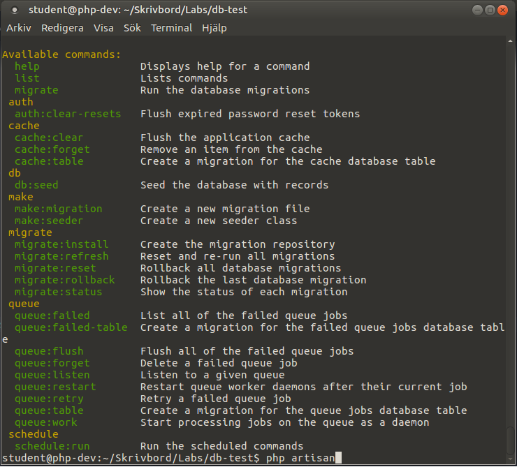

# Labb 4, Lumen - Controllers/Models/Databas

I denna labb ska vi fortsätta att lära oss om de olika komponenterna i Lumen. Vi kommer att fokusera på:
- Controllers
- Databas
    - Migration
    - Seed
- Models med ORM

Detta innebär att ni behöver ha gjort den förra laborationen och ha koll på att sätta upp ett [Lumen-projekt](https://lumen.laravel.com/docs/5.4), [routing](https://lumen.laravel.com/docs/5.4/routing), [requests](https://lumen.laravel.com/docs/5.4/requests), [resonses](https://lumen.laravel.com/docs/5.4/responses) etc. Behöver ni repetera detta så rekommenderar vi starkt att ni tittar på den [förra laborationen](../3/lumen.md).

## 1. Förberedelser

### 1.1. Skapa ett nytt Lumen-projekt
Skapa ett nytt lumen-projekt som ni exempelvis kallar för `Lab4` genom:
```bash
lumen new Lab4
```
Alternativt:
```bash
composer create-project --prefer-dist laravel/lumen Lab4
```
Testa så att projektet installerats korrekt genom att i *terminalen* navigera till mappen `public` och starta upp en webbserver där genom:
```php
php -S localhost:8080
```
Surfa sedan till [http://localhost:8080/](http://localhost:8080/) för att se att allt fungerar som det ska.

### 1.2. Installera memcached
Lumen använder sig av [memcached](https://memcached.org/) för cachning, vilket vi behöver installera. Detta gör vi genom följande komandon i *terminalen*:
```bash
$ sudo apt-get install php-memcached
```

```bash
$ sudo apt-get install memcached
```

```bash
$ sudo service memcached status
```

Alternativet om man kör windows och inte vill installera memcached, så kan man kan ändra sin `.env`-fil till:
```
CACHE_DRIVER=array
QUEUE_DRIVER=array
```

Vi kommer senare i labben att använda oss utav `php artisan`, nu när ni installerat memcached så dubbelkolla att detta fungerar som förväntat genom att i *terminalen* (i ert lumen-projekt) skriva:
```bash
php artisan
```
Fungerar det som förväntat så borde det se ut såhär:


## 2. Labbuppgiften - Förbättra vårt produkt-API
Vi ska förbättra vårt produkt-API från förra labben och istället för att bygga en lösning när vi sparar produkterna i `json`-format, spara dessa i en databas. Vi ska dessutom använda `migrations` för versionshantering av databasen och `seeds` för att populera databasen. Detta för att underlätta utvecklingen av API:t.

### 2.1. Resurser
Vi ska i denna labb hantera tre resurser, med följande egenskaper:
1. Produkt
    - id
    - titel
    - pris
    - skapad
    - uppdaterad
2. Butik
    - id
    - namn
    - stad
    - skapad
    - uppdaterad
3. Recension
    - id
    - betyg
    - kommentar
    - skapad
    - uppdaterad

De ska ha följande relationer:
- En produkt kan tillhöra flera butiker
- En butik kan ha flera produkter
- En produkt kan ha flera recensioner
- En recension kan bara tillhöra en produkt

Inspireras gärna av [tillhörande föreläsning](../../Lectures/5/lecture.md) och föreläsningens exempel som ni kan hitta [här på GitHub](https://github.com/Tibbelit/da287a-lumen-movie-example).

#### 2.1.1 Rita ett ER-diagram
Utifrån beskrivningen ovan, skapa ett ER-diagram. Diskutera gärna ER-diagrammet med era kursare och handledare för att få detta korrekt innan ni går vidare.

#### 2.1.2. Skapa migrations
Nu är dags för er att skapa tabellerna i databasen genom `migrations`. Känner ni er inte bekväma mer `migrations` så läs den [officiella dokumentation](https://laravel.com/docs/5.4/migrations), titta på hur vi skapade våra migrations i [senaste föreläsningen]() och titta på de `schema` vi skapade för våra `migrations` på föreläsningen [genom GitHub](https://github.com/Tibbelit/da287a-lumen-movie-example/tree/master/database/migrations).

Skapa följande tabeller (tänk på att följa namngivningskonventaioner för laravel/lumen: singular och gemener):
- products
    - id (int, auto_increment, primary key)
    - title (varchar)
    - price (float)
- stores
    - id (int, auto_increment, primary key)
    - name (varchar)
    - city (varchar)
- reviews
    - id (int, auto_increment, primary key)
    - product_id (int)
    - rating (int)
    - comment (text)
- product_store
    - id (int, auto_increment, primary key)
    - product_id
    - store_id

Alla tabeller ska sedan ha kolumnerna `created_at` och `updated_at` som ni kan skapa genom följande kod i alla tabellerna:
```php
$table->timestamps();
```

När ni skapat och definierat `migrations` för tabellerna ovan så kör
```bash
php artisan migrate
```
för att verkställa era `migrations` och skapa tabellerna.

#### 2.1.3. Skapa seeding
En databas utan data är inte speciellt roligt! Det är därför dags för er att skapa lite data som vi kan arbeta med i labben. Skapa följande:
- Minst tre produkter
- Minst tre butiker
- Skapa kopplingar mellan produkter och butiker (många till många-relation)
- Skapa minst tre recensioner som ni kopplar till valfria produkter.

Känner ni er inte bekväma mer `seeding` så läs den [officiella dokumentation](https://laravel.com/docs/5.4/seeding), titta på hur vi skapade våra seeds i [senaste föreläsningen]() och titta på de `inserts` vi     skapade för våra `seeding` på föreläsningen [genom GitHub](https://github.com/Tibbelit/da287a-lumen-movie-example/tree/master/database/seeds).

När ni skapat och definierat `seeds` för tabellerna ovan så kör
```bash
php artisan db:seed
```
för att verkställa era `seeds` och populera tabellerna.


### 2.2. Uppdatera/bygg era routes & controllers
Nu när vi har en databas som kan förse vår applikation med data (produkter/butiker/recensioner) så ska vi strukturera upp vår applikation, likt det vi gjorde förra laborationen. Gör routes för att:
1. Hämta alla produkter
2. Hämta detaljerad information om en produkt

De routes som ni skapar ska skicka vidare anropet till en controller vid namn `ProductsController`. I er `ProductsController` skapa följande funktioner:
1. `index`
    - listar alla produkter
2. `show`
    - visar detaljerd information om en produkt.
        - Basinformation om produkten
        - Vilka butiker den finns i
        - Recensioner kring produkten

Behöver ni inspiration för hur detta ska göras, så titta i den [officiella dokumentation](https://laravel.com/docs/5.4/seeding), samt i det exempel som vi [gjorde på föreläsningen](https://github.com/Tibbelit/da287a-lumen-movie-example/tree/master). Ni ska göra i princip samma sak som vi gjorde med filmerna.

## 3. Vidareutveckling av er webbtjänst
Nu har ni byggt en bra grund för er webbtjänst! Men det finns mycket kvar att göra! Beroende på hur mycket tid ni har, så är här några punkter som borde vidareutvecklas:
- Visa upp butiker / butik med produkter
- Visa upp recensioner / recension med produkt
- CRUD (create, read, update, delete) för alla våra resurser.

Har ni frågor på dessa punkterna så fråga gärna labbhandledaren!
