# Labb 8, Delivery, Deployment & Integration

I denna labb ska vi sätta upp en miljö för Continuous Integration & Delivery. Vi kommer att utgå från projektet som gjordes i lab 7.

## Upplägg på labben

1. Skapa en virtuell maskin i Azure.
2. Pusha förra veckans labbuppgift till GitHub.
3. Förbered Travis CI.
4. Konfigurera projektet.
5. Kontrollera att allt fungerar.

## 1. Skapa en virtuell maskin i Azure

[Microsoft Azure](https://azure.microsoft.com) är Microsofts tjänst för cloud computing. Tjänster erbjuder lösningar för IaaS, PaaS och SaaS. Vi kommer i den här labben att titta på en IaaS-lösning genom att sätta upp en virtuell Ubuntu-server. En rimligare lösning hade i vårt fall egentligen varit att använda en [Docker-baserad](https://www.docker.com/) lösning eller en av Azures Web Apps. Det är dock inget vi har tillgång till i den här kursen.

### 1.1. Logga in på Azure

Det första vi måste göra är att logga in på Azure. Börja med att gå in på [https://portal.azure.com](https://portal.azure.com).

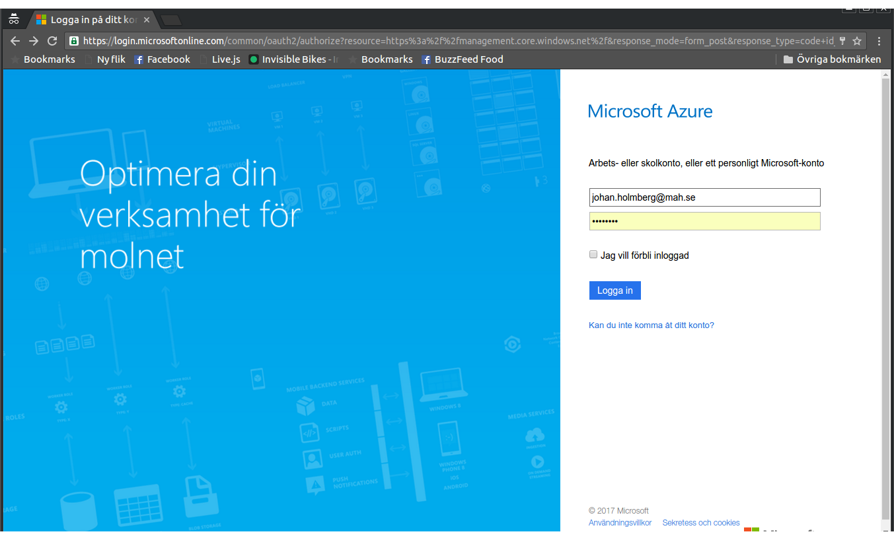

Ange en e-postadress på mah.se-domänen. Eftersom du troligtvis inte har en egen kan du ange vad som helst, exempelvis fsjal@mah.se. Det viktiga är att Azure känner igen att du vill använda en inloggning från MAH. Du kan nu ange ditt dator-id och lösenord. När du är inloggad

### 1.2. Skapa din virtuella maskin

När du har loggat in möts du av din instrumentpanel. I panelen "Alla resurser" kommer du att kunna se resursgruppen **da287a** (se nedan). Klicka på den.

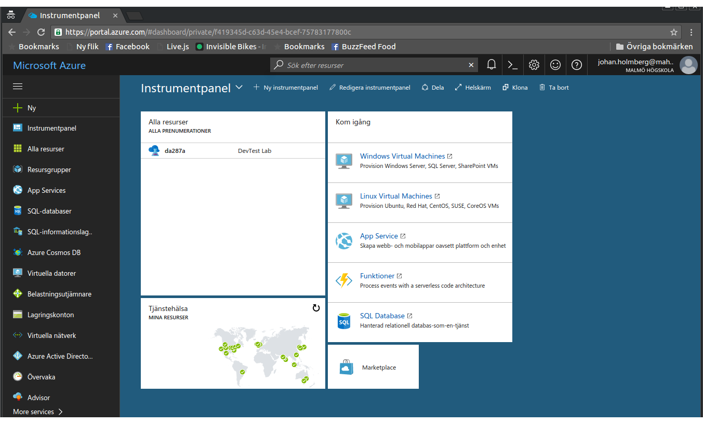

Du kommer nu till resursgruppsvyn, där du kan se resursgruppens viruella maskiner (se bild). Det är här du skapar din virtuella maskin genom att klicka på *+ Lägg till*.

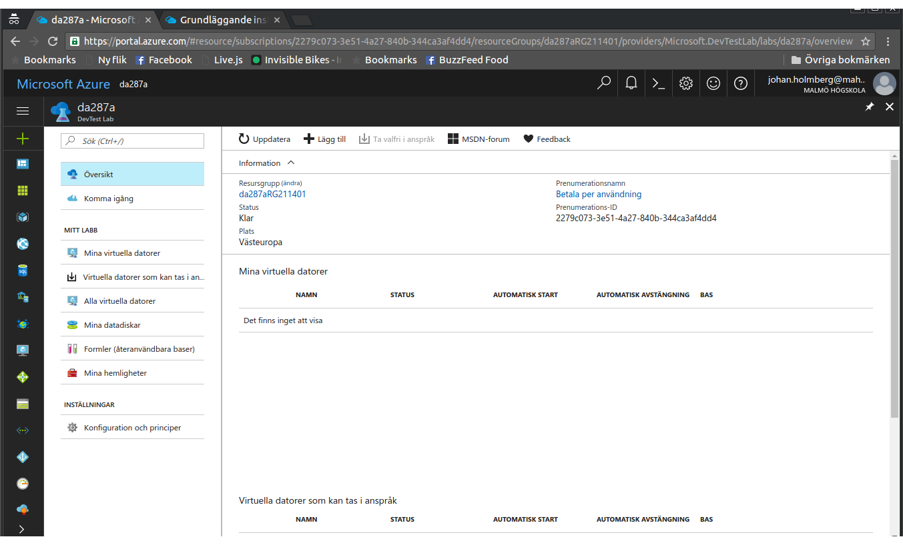

När du gjort det, tas du till arbetsflödet för skapande av nya maskiner. Ditt första steg är att välja en bas för din virtuella maskin. Det enda val du kan göra här är att skapa en virtuell Ubuntu-server.

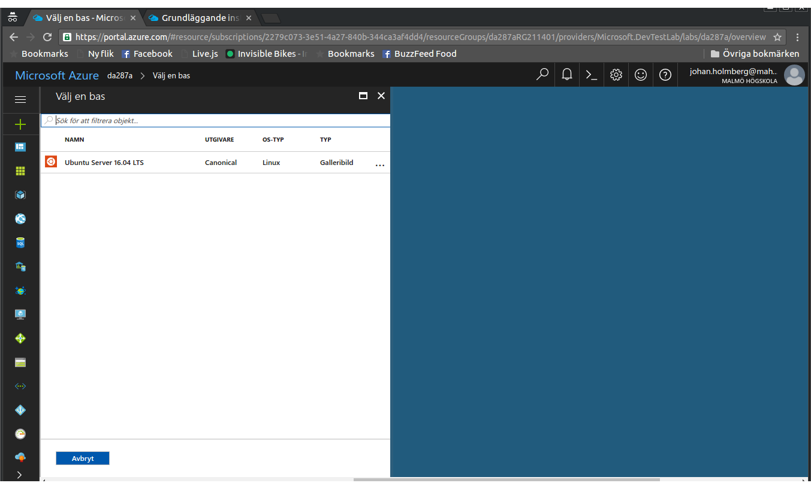

I nästa vy anger du namnet på din virtuella dator. Observera att den inte kan heta samma sak som någon annan dator i resursgruppen. Det innebär att du inte kan låta din dator heta *insultr* som på bilden.

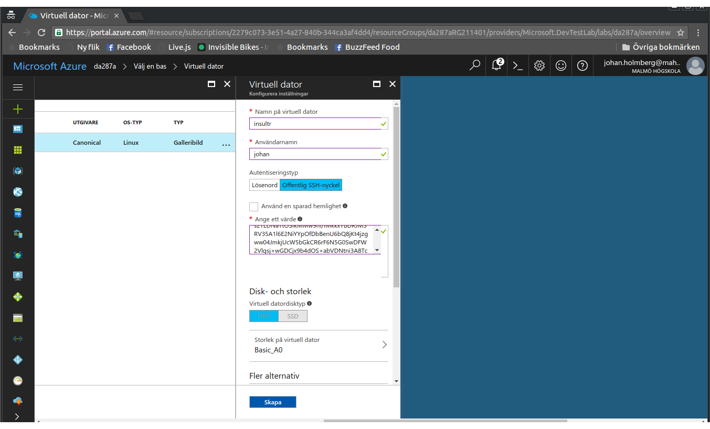

Ange ett användarnamn. Det är detta du kommer att använda för att logga in på din virtuella dator när den är klar. Vi använder "johan" i exemplet. När det dyker upp senare i texten byter du ut "johan" mot ditt eget användarnamn. Under *autentieringstyp* väljer du *Lösenord*. Ange ett lösenord som du inte glömmer - du kommer inte att kunna återställa det. Klicka sedan på *Avancerade inställningar*.

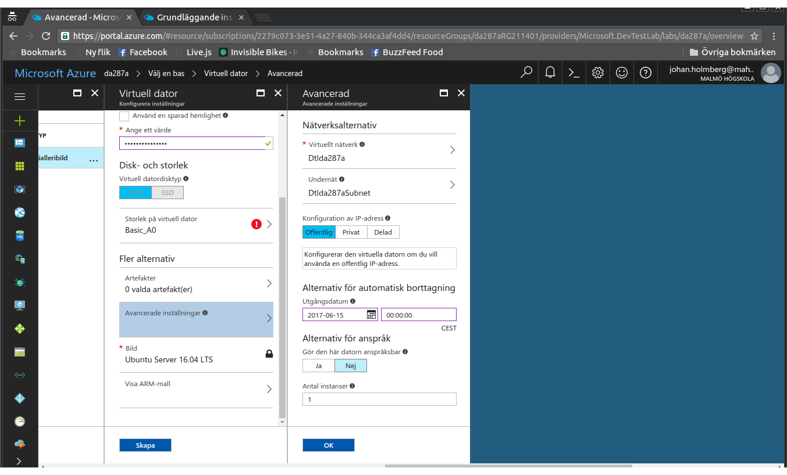

Du kan nu ange nätverksalternativ. Här måste du välja alternativet *Offentlig* under *Konfiguration av IP-adress*. Klicka på *OK* och sedan på *Skapa*. Du kommer nu tillbaka till instrumentpanelen. Här ser du att din nya virtuella maskin håller på att skapas. Det här tar en stund. 


När dn virtuella maskinen har skapats kommer den att startas. Dubbelklicka på din nya maskin för at välja den.

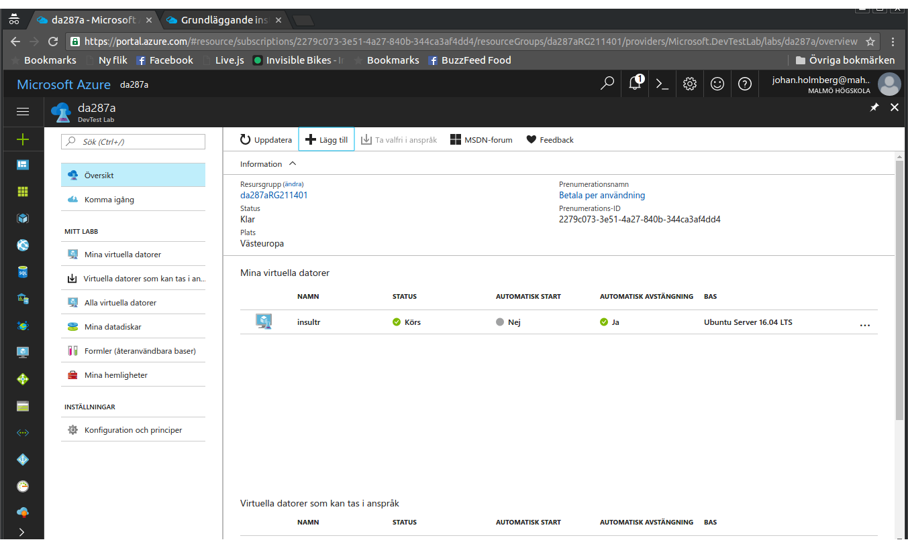

Du kan nu se vad din nya virtuella dators domännamn är under *IP-adress eller FQDN*. Skriv upp vad det är. I våra exempel är det *insultr.westeurope.cloudapp.azure.com*. Du byter ut exemplet mot ditt eget domännamn när det dyker upp i texten nedan.

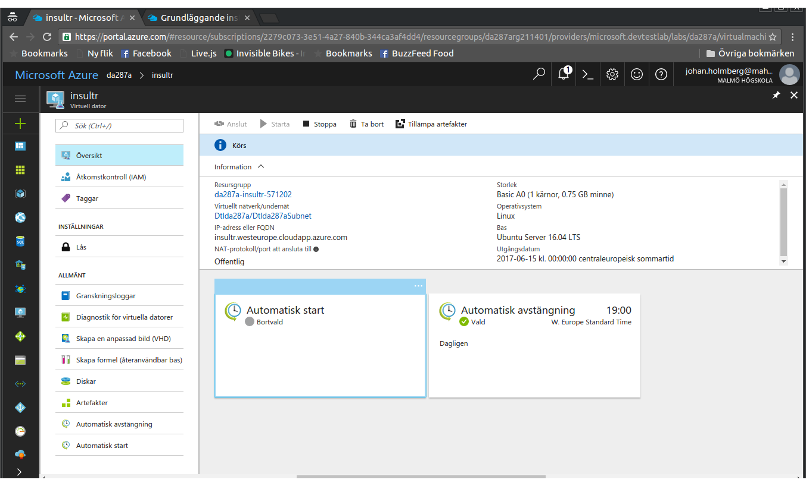

### 1.3. Konfigurera din virtuella maskin

#### 1.3.1. Logga in på maskinen

Starta upp en terminal och logga in på den nya virtuella maskinen med hjälp av SSH:

```bash
$ ssh insultr.westeurope.cloudapp.azure.com -l johan
```

Du kommer att få en fråga om du vill lägga till en autentieringsnyckel. Svara ja på frågan genom att skriva "yes" och trycka på enter. Du är nu inloggad på den virtuella maskinen hos Azure. Notera att det ser ut nästan precis som vanligt i terminalen.

#### 1.3.2. Installera PHP och Apache

Din virtuella server innehåller just nu inte särskilt mycket. Du behöver därför installera en webbserver och PHP. MySQL behöver du inte för det här projektet.

```bash
$ sudo apt-get install apache2 php libapache2-mod-php php-mcrypt php-cli
```

#### 1.3.3. Installera Composer

Vi behöver även vår gamla trotjänare Composer. Installera så här:


```bash
$ wget https://getcomposer.org/composer.phar
$ sudo mv composer.phar /usr/local/bin/composer
$ sudo chmod +x /usr/local/bin/composer
```

#### 1.3.4. Förbered för driftsättning

Vi behöver konfigurera Apache för att kunna köra vårt nya projekt. Det här kräver lite finlir, så håll tungan rätt i mun här.

Skapa en katalog för projektet i din nya hemkatalog:

```bash
$ mkdir ~/insultr
```

Nu behöver du länka till katalogen från Apaches www-katalog:

```bash
$ sudo ln -s ~/insultr /var/www/insultr
```

Nästa steg är att skapa en konfiguration för den nya tjänsten och be Apache att använda den:

```bash
$ sudo cp /etc/apache2/sites-available/000-default.conf /etc/apache2/sites-available/insultr.conf
$ sudo rm /etc/apache2/sites-enabled/000-default.conf
$ sudo ln -s /etc/apache2/sites-available/insultr.conf /etc/apache2/sites-enabled/insultr.conf
```

Nu behöver du ändra i konfigurationsfilen för att peka på rätt katalog. Öppna upp filen i nano:

```bash
$ sudo nano /etc/apache2/sites-available/insultr.conf
```

Hitta raden

```
DocumentRoot /var/www/html
```

och ersätt den med

```
DocumentRoot /var/www/insultr/src
```

Det sista steget är att starta om Apache för att genomföra förändringarna:

```bash
$ sudo systemctl restart apache2
```

#### 1.3.5. Logga ut

Det sista du behöver göra är att logga ut från den virtuella maskinen. Du gör detta genom att skriva följande i terminalen:

```bash
$ exit
```

## 2. Pusha förra veckans labbuppgift till GitHub

Om du inte gjorde förra veckans labbuppgift - gör den innan du gör den här labben. Om du redan har pushat den till GitHub kan du hoppa över hela den här deluppgiften.

### 2.1. GitHub

Gå till GitHub och skapa ett tomt, publikt repository. Lägg inte till något i det, ingen .gitignore och ingen README. Kom ihåg vad du har sparat det som. I vårt exempel heter vårt repository *insultr* och vi använder Johans GitHub-alias *koddas*. Du använder så klart ditt eget GitHub-alias istället.

### 2.2. Ditt lokala repository

Öppna terminalen och gå till katalogen där du sparade förra veckans labbuppgift. Peka om projektet på ditt nya GitHub-repository så här:

```bash
$ git remote set-url origin https://github.com/koddas/insultr
$ git remote add upstream https://github.com/koddas/insultr
$ git push
```

Nu finns förra veckans labbuppgift tillgänglig på GitHub.

## 3. Förbered Travis CI

### 3.1. Skapa ett konto hos Travis CI

Gå in på [Travis CI](https://travis-ci.org/) och logga in på ditt Github-konto. Detta behöver du göra för att Travis CI ska kunna se dina projekt på GitHub. När du loggat in ser du dina publika GitHub-projekt (vill du använda Travis CI för privata projekt får du betala för det). Välj det projekt som du vill automatbygga med Travis CI, exempelvis *koddas/insultr*. Det ser ut så här: 

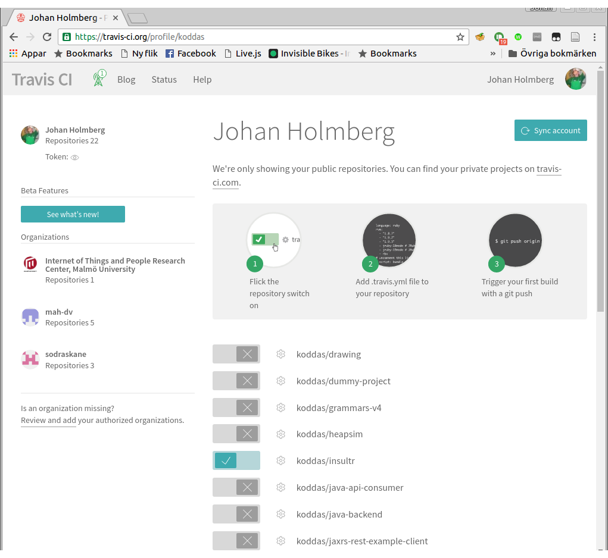

### 3.2. Skapa miljövariabler

Klicka på det lilla kugghjulet bredvid ditt projektnamn. Du kommer nu till en sida där du kan skapa *miljövariabler* (engelska: *environment variables*). Dessa kommer vi att använda oss av i bygget för att undvika att spara känsliga uppgifter i konfigurationsfilen som sedan publiceras på GitHub.

Vi vill skapa två miljövaribler: `DEPLOY_HOST`, som pekar på vår virtuella maskin, och `DEPLOY_USER`, som anger vad vår användare på den virtuella maskinen heter. Klicka i *Display value in build log* för bättre loggning av byggena. I vårt exempel skulle det se ut så här efter att variablerna är skapade:

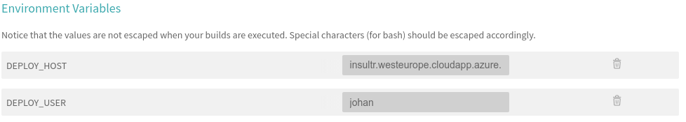

## 4. Konfigurera projektet

### 4.1. Skapa en .travis.yml

Travis CI styrs av ett gäng direktiv, inte helt olikt hur vi berättar för Composer hur den ska hantera vårt PHP-projekt. För att detta ska fungera behöver vi skapa en fil som heter *.travis.yml*. Notera punkten i början av filen. Den är där för att, precis som vår gamla kompis *.gitignore* berätta för operativsystemet att det här är en speciell fil som för det mesta inte behöver synas för användaren, i det här fallet PHP-utvecklaren.

Stå kvar i din projektkatalog (om du inte gjorde steg 2: gå till din projektkatalog) och skapa en tom fil genom att skriva

```bash
$ nano .travis.yml
```

Nu är det dags att skriva filen. Vi kommer att skriva filen i ett sjok och sedan förklara varje direktiv för sig. Kopiera in följande text i filen och spara den sedan:

```
os:
- linux
addons:
  ssh_known_hosts:
  - insultr.westeurope.cloudapp.azure.com
cache:
  directories:
  - "$HOME/.composer/cache"
language: php
php:
-7.0
install:
- composer install
script: vendor/bin/phpunit --configuration phpunit.xml --coverage-text
deploy:
- provider: script
  skip-cleanup: true
  script:
  - rsync -r --delete-after --quiet $TRAVIS_BUILD_DIR $DEPLOY_USER@$DEPLOY_HOST:/home/johan
  on:
    branch: master
notifications:
  email:
    recipients: din.egen.epostadress@domän.se
```

Så, vad betyder de olika delarna? Från topp till slut:

```
os:
- linux
```

Här berättar vi för Travis CI att vi kommer att använda en Linux-server som målmaskin. Detta gör att Travis CI kommer att köra alla byggen och tester på en Linux-maskin.

```
addons:
  ssh_known_hosts:
  - insultr.westeurope.cloudapp.azure.com
```

Här berättar vi för Travis CI att det ska acceptera SSH-anslutningar till vår virtuella maskin (det som vi manuellt gjorde i 1.3.1).

```
cache:
  directories:
  - "$HOME/.composer/cache"
```

Här berättar vi att vi vill spara undan filer som kommer att laddas ner ofta. I praktiken innebär det att vi sparar undan Composer-paketen.

```
language: php
php:
-7.0
```

Här berättar vi att applikationen är en PHP-applikation, och att vi vill att Travis CI ska testa och validera för version 7.0. Vi kan, om vi vill, ange fler versioner genom att lägga till fler rader (exempelvis `-5.6` eller `-7.1` ).

Nästa steg kräver att vi förstår hur Travis CI fungerar. Verktyget gör ett bygge i tre faser: *install*, * script* och *deploy*. Dessa faser har dessutom två stycken extra-faser för varje huvudfas: `before_` och `after_`, vilka används för att förbereda och städa upp. Varje fas har en specifik uppgift:

* I *install*-fasen installerar Travis CI alla beroenden som applikationen har för att kunna köras:

```
install:
- composer install
```

* I *script*-fasen körs alla tester. När och om dessa går igenom kommer Travis CI sedan att genomföra själva bygget. I vårt fall med PHP innebär det att Travis CI faktiskt inte gör någonting, men om vi gjort ett projekt i exempelvis Java eller C# hade det här inneburit att koden kompilerats och paketerats. Eventuell automatisk dokumentationsgenerering sker också nu:

```
script: vendor/bin/phpunit --configuration phpunit.xml --coverage-text
```

* I *deploy*-fasen driftsätts koden. I vårt fall innebär det att Travis CI ska lyssna på när vi gör en push av vår master-branch till GitHub. När detta sker, ska Travis CI ta koden och skicka den till vår virutella server:

```
deploy:
- provider: script
  skip-cleanup: true
  script:
  - rsync -r --delete-after --quiet $TRAVIS_BUILD_DIR $DEPLOY_USER@$DEPLOY_HOST:/home/johan
  on:
    branch: master
```

Slutligen vill vi att Travis CI meddelar oss när ett bygge är avslutat, oavsett om det gick bra eller inte:

```
notifications:
  email:
    recipients: din.egen.epostadress@domän.se
```

### 4.2. Skapa en SSH-nyckel

För att Travis CI ska kunna driftsätta ditt projekt på den virtuella maskinen måste du använda en SSH-nyckel. Första steget på den resan blir att installera de program som behövs för detta. Det här tar en stund:

```bash
$ sudo apt-get install build-essential bison openssl libreadline6 libreadline6-dev curl git-core zlib1g zlib1g-dev libssl-dev libyaml-dev libxml2-dev autoconf libc6-dev ncurses-dev automake libtool ruby ruby-dev
$ sudo gem install travis
```

Nu har du installerat alla program som behövs för att generera ett SSH-nyckelpar (*openssl*) och för att få Travis att kunna kryptera det (alla andra program i listan). Nästa steg är att skapa nycklarna, kryptera den (eftersom vi inte vill publicera våra nycklar hur som helst på GitHub) och skicka den publika nyckeln till den virtuella maskinen och den privata till GitHub:


```bash
$ ssh-keygen -t rsa -b 4096 -C 'build@travis-ci.org' -f ./deploy_rsa
$ travis encrypt-file deploy_rsa --add
$ ssh-copy-id -i deploy_rsa.pub johan@insultr.westeurope.cloudapp.azure.com
$ git add deploy_rsa.enc .travis.yml
```

Till sist tar vi bort nycklarna från den lokala datorn. Vi vill inte ha dem liggandes här i onödan:

```bash
$ rm -f deploy_rsa deploy_rsa.pub
```

## 5. Kontrollera att allt fungerar

Pusha dina förändringar till GitHub. Gå sedan in på [Travis CI](https://travis-ci.org/) och titta på ditt projekt. Bygger det som det ska? Det borde det göra. När det är färdigt, gå in på din nya tjänst (exempelvis [insultr.westeurope.cloudapp.azure.com](http://insultr.westeurope.cloudapp.azure.com)) och kontrollera att det fungerar även där.

Nedan syns en statusskärm på Travis CI med två projekt igång. Det översta, *koddas/insultr*, har inte lyckats byggas. Det undre, som också syns på huvudskärmen, har lyckats och är därför grönt.

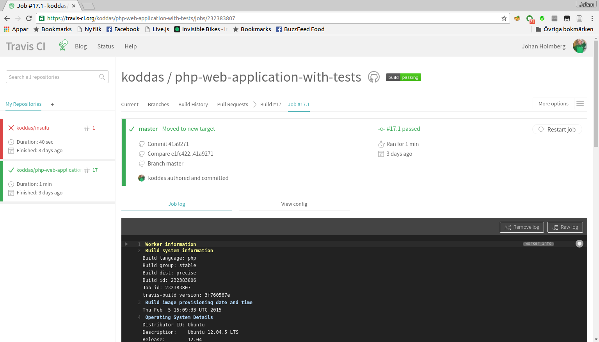

Nu har du skapat en virtuell maskin, satt upp en toolchain för CI/CD och borde vara nöjd med dig själv. Wohoo!
